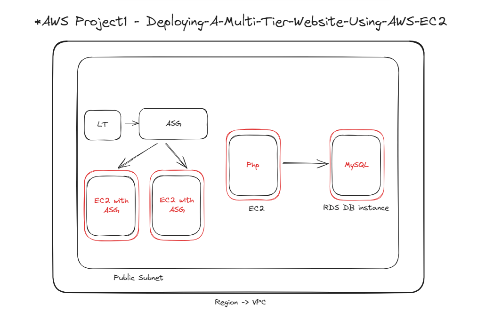
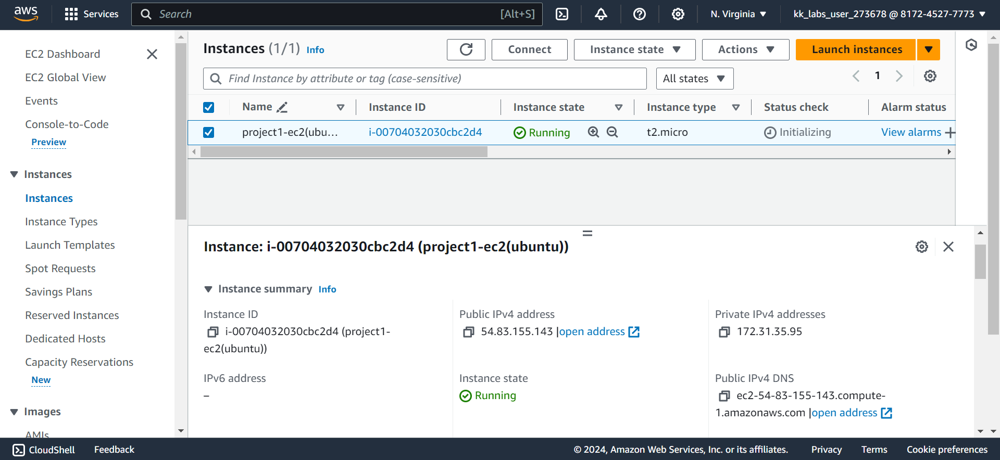
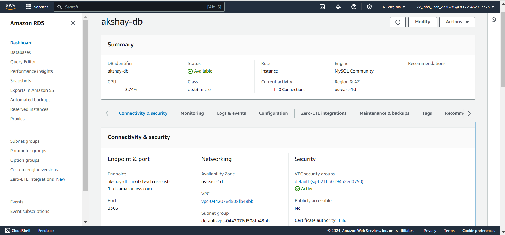

## Problem Statement

Company ABC wants to move their product to AWS. They have the following things set up right now:

1. MySQL DB
2. Website (PHP)

The company wants high availability on this product, therefore wants Auto Scaling to be enabled on this website.

## Architecture/Visual Flow diagram:

## Tasks Performed

1. Created EC2 instance(Ubuntu)

2. Created RDS instance(with default gateway (connected to internet) and in same AZ as EC2 instance)
3. Create Internet Gateway -> Make Internet flow through VPC (if you get problem in connecting the instance).
4. Allowed all traffic to the Security Groups to resolve connection issues with DB instance![[/images/Pasted-image-20240323203643.png]]
5. Installed Webserver(httpd(centos) or apache2(ubuntu)) on EC2 and change directory to `/var/www/html` ![[Assignments and Projects/12. AWS Projects/project1/images/Pasted image 20240323200821.png]]
6. Removed index.html and add index.php and copied the given the code into it. ![[Assignments and Projects/12. AWS Projects/project1/images/Pasted image 20240323201307.png]]
7. Ran this command: `sudo add-apt-repository -y ppa:ondrej/php` -> We're adding a repo for a particular php file (index.php). To establish a connection, we need to add this repo for our webpage to work![[Assignments and Projects/12. AWS Projects/project1/images/Pasted image 20240323201405.png]]
8. Installed Php and MySQL client: `sudo apt install php5.6 mysql-client php5.6-mysqli`![[Assignments and Projects/12. AWS Projects/project1/images/Pasted image 20240323201542.png]]
9. Copied the RDS DB endpoint and the paste it in the servername variable in index.php and corrected the username to "admin" ![[Assignments and Projects/12. AWS Projects/project1/images/Pasted image 20240323201939.png]]
10. Created Table to put data inside it when we write something in the form ->We need to connect MYSQL Db to Web application -> `mysql -h <database-endpoint> -u admin -p` and entered the password: intel123![[Assignments and Projects/12. AWS Projects/project1/images/Pasted image 20240323203735.png]]
11. First Check all the databases by listing them using: `show databases;`![[Assignments and Projects/12. AWS Projects/project1/images/Pasted image 20240323203839.png]]
12. Select `intel` database using command: `use intel;`
13. Created table: `create table data(firstname varchar(15), email varchar(25));`
14. To view what data we have in table: `select * from data;`![[Assignments and Projects/12. AWS Projects/project1/images/Pasted image 20240323204242.png]]![[Assignments and Projects/12. AWS Projects/project1/images/Pasted image 20240323204052.png]]
15. Created Autoscaling for the purpose of High Availability. for that first step is creating image from ec2. ![[Assignments and Projects/12. AWS Projects/project1/images/Pasted image 20240323204516.png]]
16. Created Launch Template![[Assignments and Projects/12. AWS Projects/project1/images/Pasted image 20240323204702.png]]
17. Successfully Created ASG without LB to just create VMs:![[Assignments and Projects/12. AWS Projects/project1/images/Pasted image 20240323204909.png]]
18. Reference:![[Assignments and Projects/12. AWS Projects/project1/images/Pasted image 20240323205041.png]]
