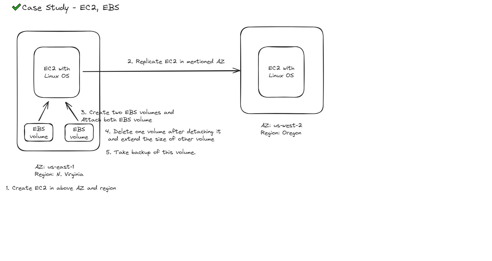

## Problem Statement

You work for XYZ Corporation. Your corporation is working on an application and they require secured web servers on Linux to launch the application.

## Tasks Performed

1. Created an instance in the US-East-1 (N. Virginia) region with Linux OS and managed the requirement of web servers of XYZ company using AMI.
2. Replicated the instance in the US-West-2 (Oregon) region.
3. Build the two EBS volumes and attached them to the instance in the US-East-1 (N. Virginia) region.
4. Deleted one volume after detaching it and extended the size of the other volume.
5. Took the backup of this EBS volume. (self-edit)

> Solutions can be found in Images

## Architecture diagram:

