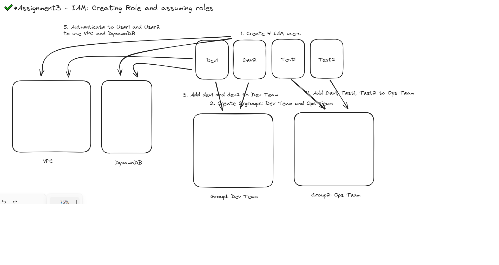

## Problem Statement

You work for XYZ Corporation. To maintain the security of the AWS account and the resources you have been asked to implement a solution that can help easily recognize and monitor the different users.

## Tasks Performed

1. Created 4 IAM users named “Dev1”, “Dev2”, “Test1”, and “Test2”.
2. Created 2 groups named “Dev Team” and “Ops Team”.
3. Added Dev1 and Dev2 to the Dev Team.
4. Added Dev1, Test1 and Test2 to the Ops Team.
5. Created a role which only lets user1(dev1) and user2(dev2) from above to have complete access to VPCs and DynamoDB.
6. Logged-in into user1 and shifted the role to test out the features.

> NOTE: Solutions can be found in Images

## Architecture/Visual Flow diagram:

